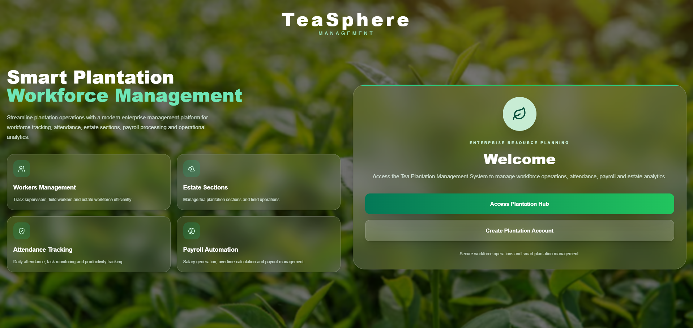
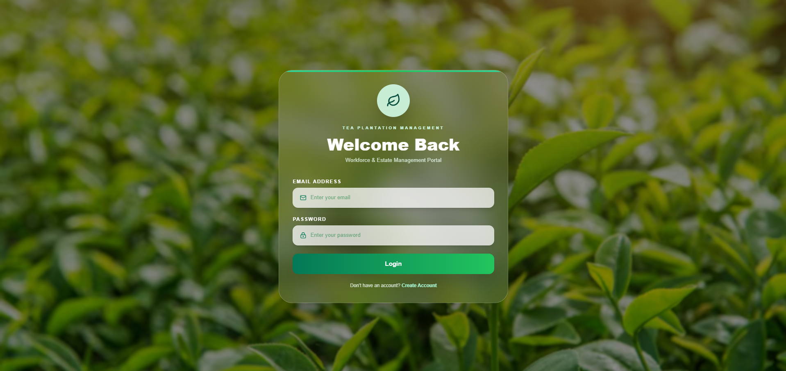
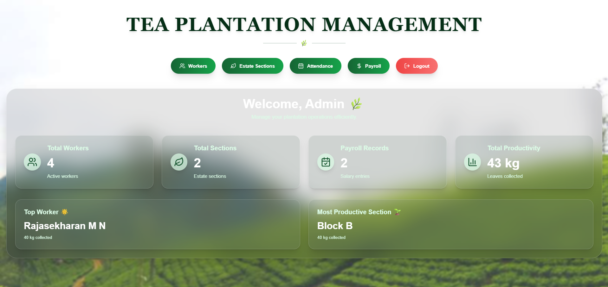
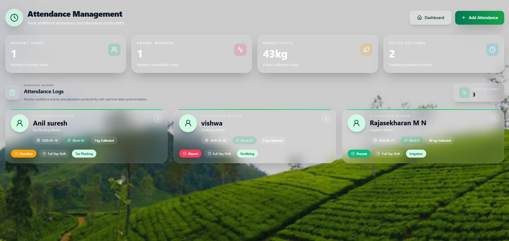
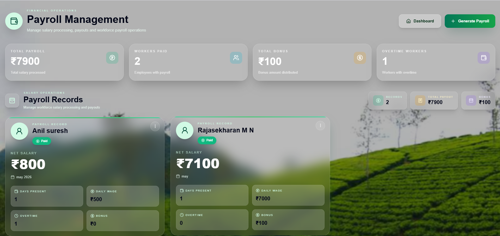
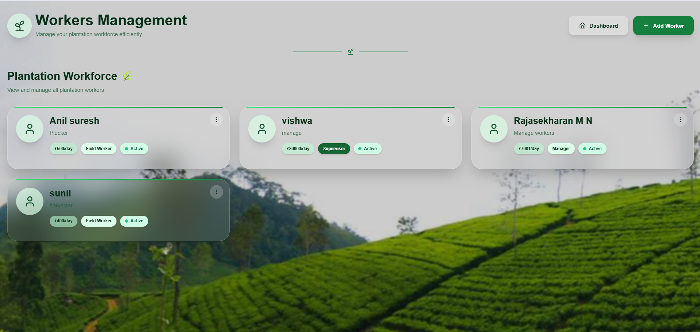
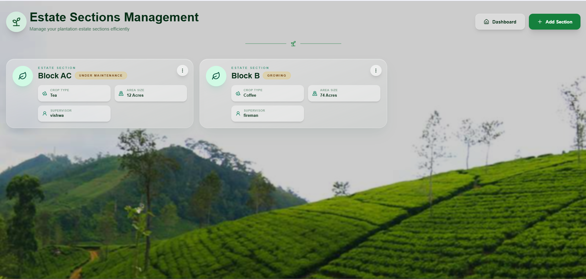

# TeaPlantationManagement
Tea plantation management system
# TeaSphere Management System

A modern Tea Plantation ERP system for managing estate operations, workers, attendance, payroll, and plantation sections through a professional enterprise-style interface.

---

## Developed By

Sreelakshmi P R

---

## Features

- Secure Login & Signup Authentication
- Workers Management
- Estate Sections Management
- Attendance Tracking System
- Payroll Management
- ERP Style Dashboard
- Modern Glassmorphism UI
- Toast Notifications
- Responsive Design
- Real-time Data Management

---

## Tech Stack

### Frontend
- React.js
- Tailwind CSS
- Lucide React Icons
- React Hot Toast

### Backend
- Node.js
- Express.js

### Database
- MongoDB

---

## Project Modules

### Authentication
- User Login
- User Signup
- Session Handling

### Workers Management
- Add Workers
- Edit Worker Details
- Delete Workers
- Worker Cards UI

### Estate Sections Management
- Create Estate Sections
- Crop Type Tracking
- Supervisor Allocation
- Area Size Management
- Section Status Tracking

### Attendance Management
- Track Daily Attendance
- Attendance Status
- Assigned Sections
- Task Management
- Quantity Collection Tracking

### Payroll Management
- Salary Calculation
- Bonus & Overtime
- Payroll Records
- Monthly Wage Tracking

### Dashboard Analytics
- ERP Overview
- Workforce Insights
- Attendance Statistics
- Payroll Summary

### Authentication
- User Login
- User Signup
- Session Handling

### Workers Management
- Add Workers
- Edit Worker Details
- Delete Workers
- Worker Cards UI

### Attendance Management
- Track Daily Attendance
- Attendance Status
- Assigned Sections
- Task Management

### Payroll Management
- Salary Calculation
- Bonus & Overtime
- Payroll Records

### Estate Sections
- Section Allocation
- Crop Tracking
- Supervisor Details

---

## Screenshots

### Home Page


### Login Page


### Dashboard


### Attendance Management


### Payroll Management


### Workers Management


### Estate Section Management


---

## Installation & Setup

### Clone Repository

```bash
git clone https://github.com/Sreelakshmi-pr04/TeaPlantationManagement.git
```

---

### Backend Setup

```bash
npm install
node server.js
```

---

### Frontend Setup

```bash
cd frontend
npm install
npm start
```

---

## Future Improvements

- Deployment on Vercel & Render
- MongoDB Atlas Integration
- Role-based Access Control
- Reports & Analytics
- PDF Export
- Dark/Light Theme Toggle

---

## Project Status

Completed ERP System Project ✅

---

## License

This project is developed for educational and portfolio purposes.